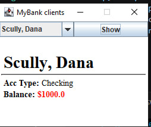

# UI Lab 3

# Лабораторна робота: Створення графічного інтерфейсу користувача (GUI) за допомогою бібліотеки Swing

**Мета роботи:** Ознайомитися з основами розробки графічних інтерфейсів на мові Java за допомогою пакету `javax.swing`, підключити зовнішні бібліотеки (`MyBank.jar`) та реалізувати базове відображення даних про клієнтів банку в інтерактивному вікні додатка.

1. У середовищі розробки налаштовано проєкт із назвою `GUIdemo`.
2. До бібліотек проєкту (папка `lib`) успішно додано файл `MyBank.jar`, який містить ядро доменної моделі банку (класи `Bank`, `Customer`, `Account`, `CheckingAccount`, `SavingsAccount`).
3. До проєкту додано файл вихідного коду `SWINGDemo.java`.

## Демонстрація роботи програми

